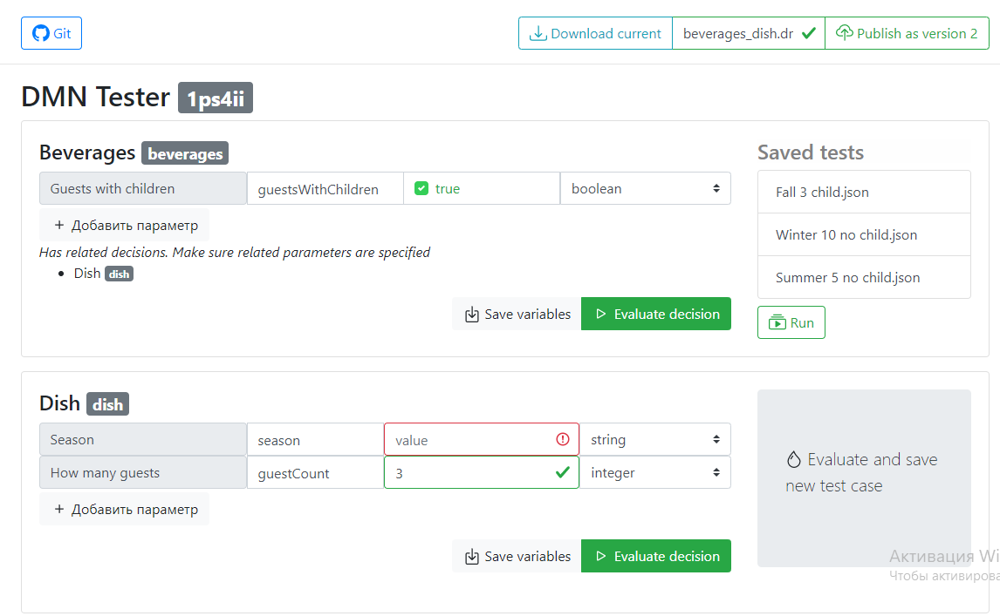

# Camunda DMN tester



```
by Express + Vue.JS with Typescript
```
using:
* bpmn-io - *for dmn migration*
* dmn-js - *for edit dmn online*
* isomorphic-git - *for store tests and dmn in git repository*
* browserfs - *for use git and fs in browser*
* cookie_js - *for store you tenant*
* bootstrap - *for cool interface*
* vue - *because it simple)*

[more docs here](docs/README.md)

### If you want develop:

`npm run serve` to run both client & server project concurrently 
 
`npm run build` to build both client & server project to dist/

#### If you want to run server & client separately 
 
`npm run dev:client` to run client project. 
 
`npm run dev:server` to run server project.  
  
  
`npm run build:client` to build client project.  
 
`npm run build:server` to build server project. 


### Docker build
docker build . -t dmn-tester:server -f server/Dockerfile
docker build . -t dmn-tester:client -f src/Dockerfile

### Environments settings
see .env files
