# DMN Tester
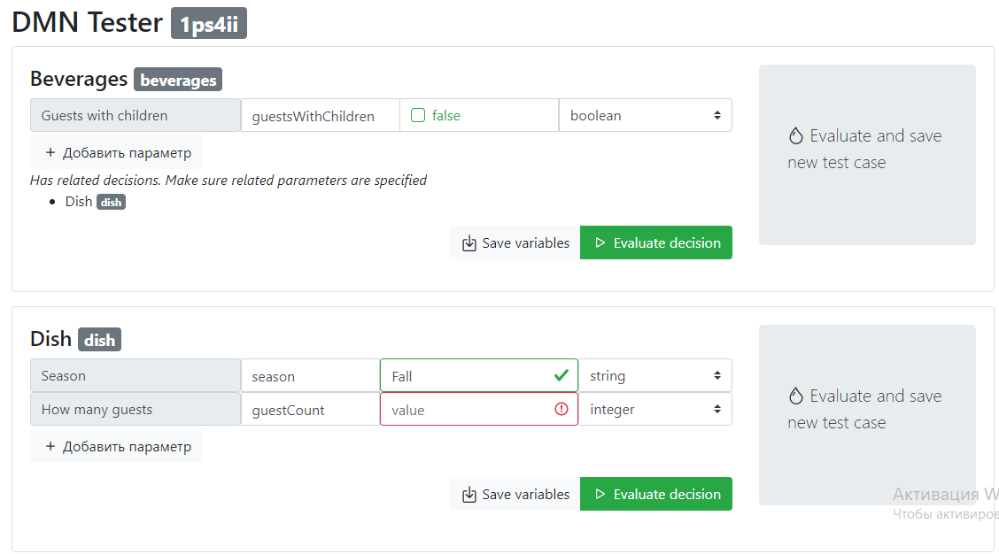
*sroll below dmn-editor*
## Use case (beverages for example)
*load dmn like [this](https://consulting.camunda.com/dmn-simulator/)*
1. Enter required values and click evaluate main decision
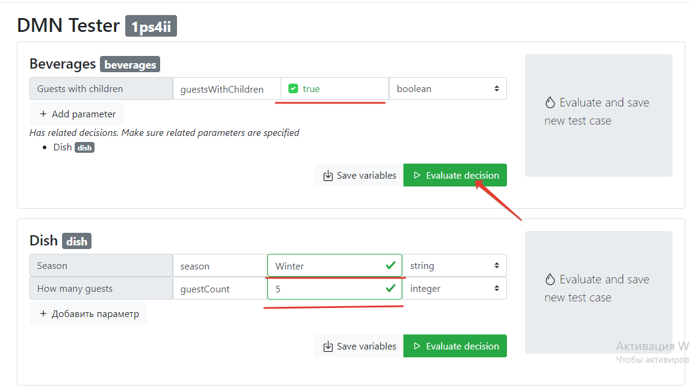
2. Now you can see results and save as test case
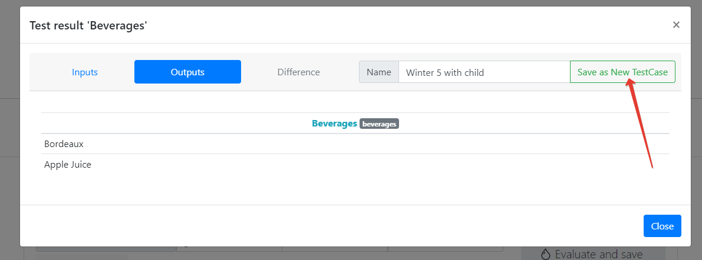
   also results will be highlihted in editor (you can change tabs to see results in related dmn tables)
   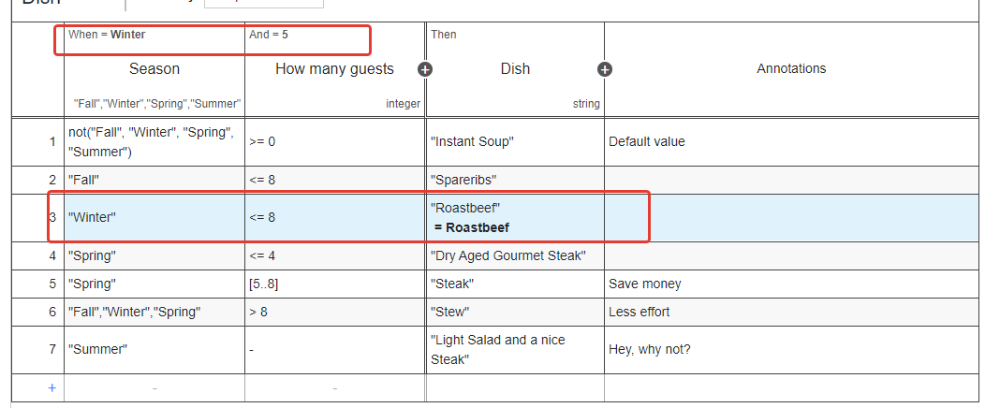
3. Run saved test cases
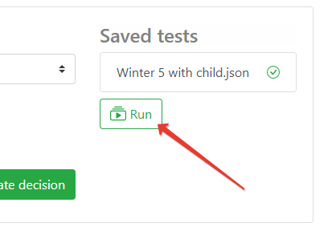
4 Do some changes in dmn editor  
   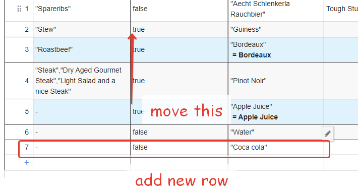
   and publish
   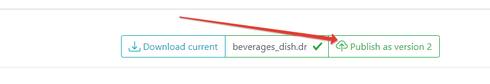
5. Again run saved test cases   
   * and click to test case with *warning" and evaluate
   * now you can see difference in result 
    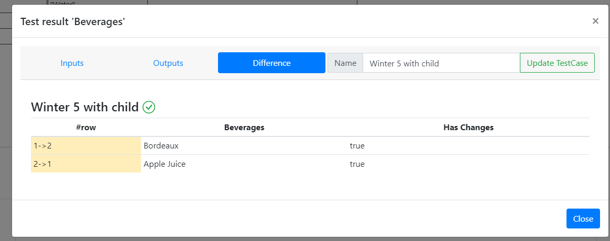

### some feautures
* autocomplite by predefined values
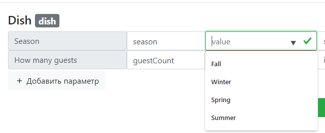
* required values
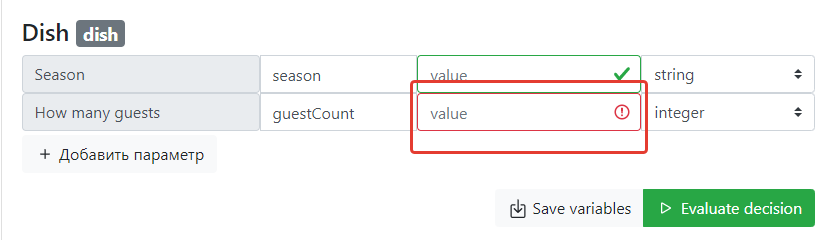
* add not defined parameters
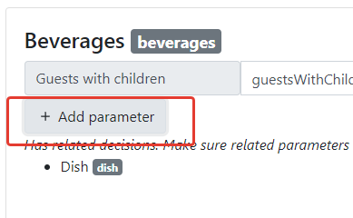
* save input parametes settings 
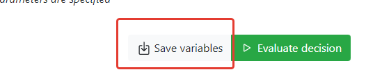
* evaluate with params
* check required params (also javascript not defined params)
* save test cases
    update test cases
    compare test cases result
* test cases / inputs / dmn - stored in [files](files.md) and you can store them in [git](git.md)
* difference between stored test case and responce
* testing works by tenant-id (generates randomly or uses you login from git)
