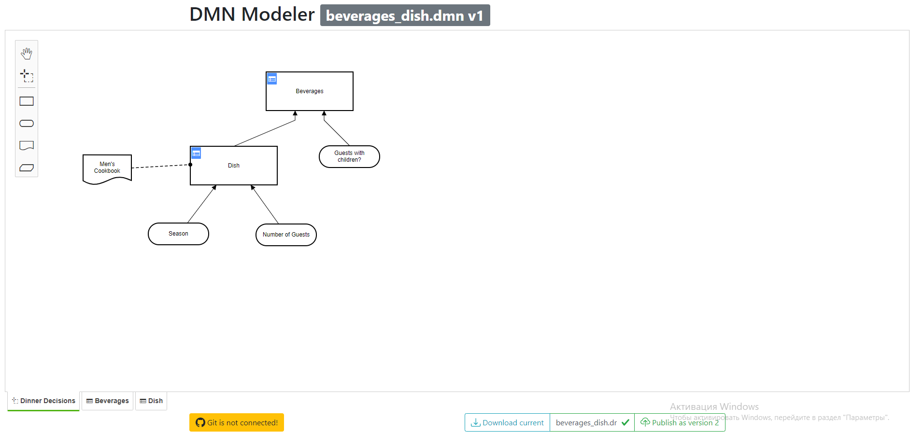

# Dmn (editor)

Dmn editor works like you`re camunda modeller

## What i can do?

* download - download dmn file from editor
* publish - publish dmn to you`re connected camunda server
* connect to [git](git.md)
* on scroll below you can see [dmn tester](dmn-tester.md)