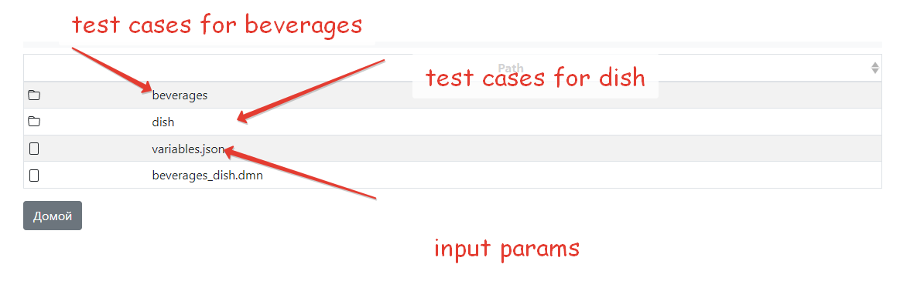

# Files - what is this?)

Files (dmn/inputs/test cases) stored in folder by decision name

* you can download any file and see how look test cases or variables
* after connect to [git](git.md) - git repository will be here
* all files stored in you browser localStorage (if you clean it - all changes will be lost)
