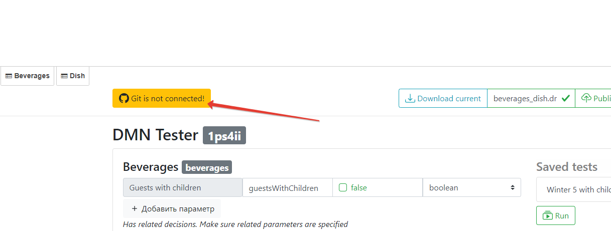
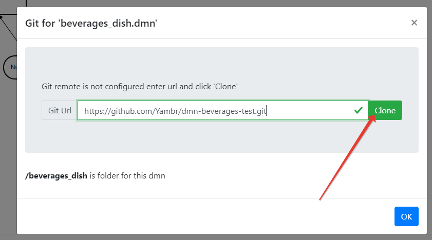
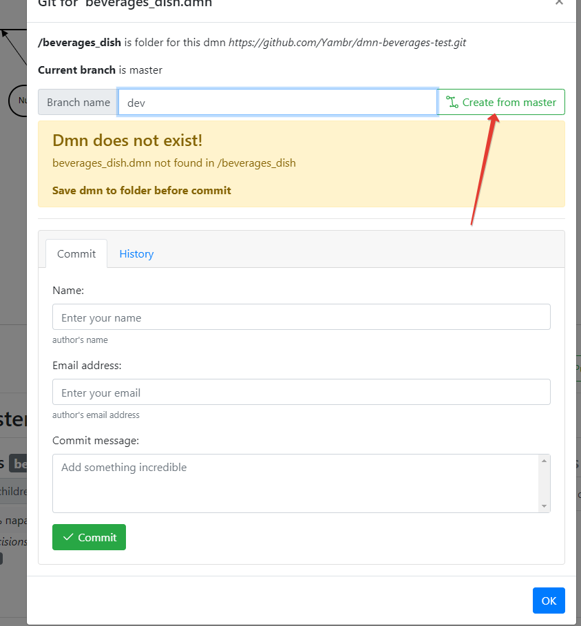
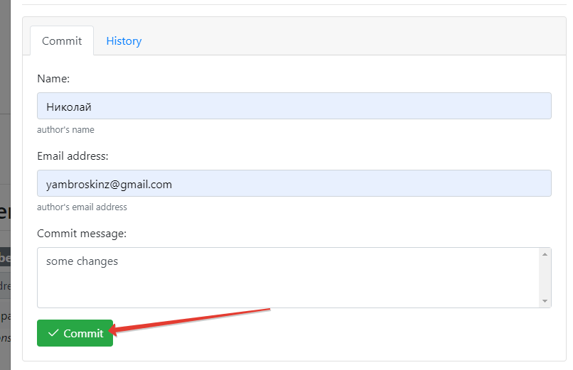
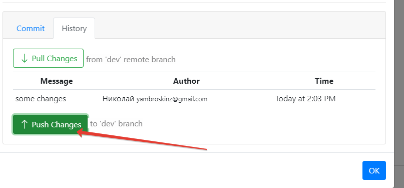
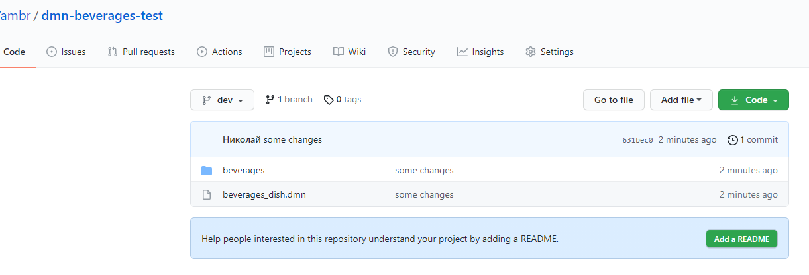

# Git 
- connect git repository for test cases and all what you see in [files](files.md)
## Use Case
1. Click to Git 
2. Enter url from you git and clone

3. Enter branch name (dev for example)

4. Publish dmn and add test cases ([example](editor.md))
5.Commit changes

6.And push changes
   
   
All pushed to you`re git repo!)
