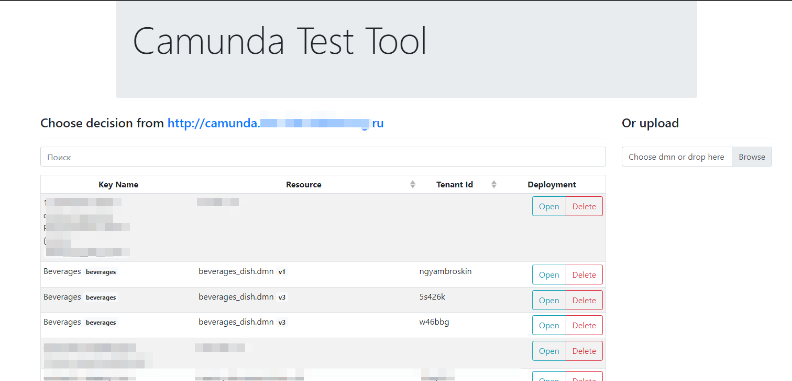
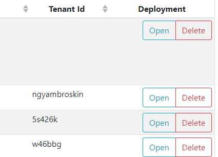
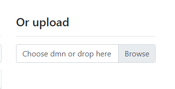

# Home page

### How it works
Camunda dmn tester connecting to you camunda server (set in environment variable)

#### Searching Dmn
1. Search works by key of you dmn
2. You Can open dmn from you camunda server

   or delete decision(deployment) from server
   
#### Open Dmn

Also you can open dmn from local PC, dmn will be published on you`re camunda server and opened in [editor](editor.md)